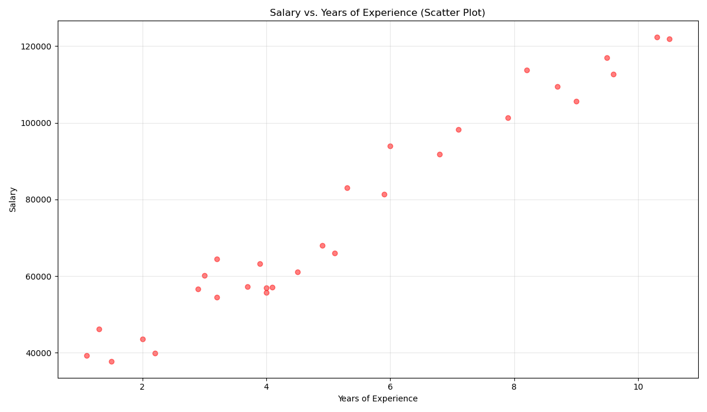
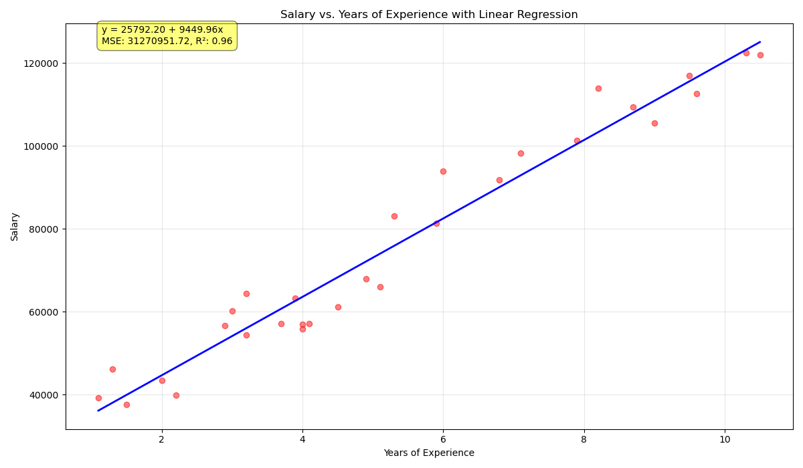
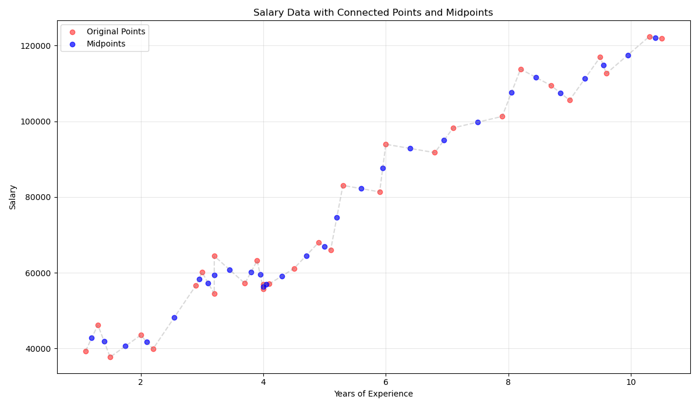
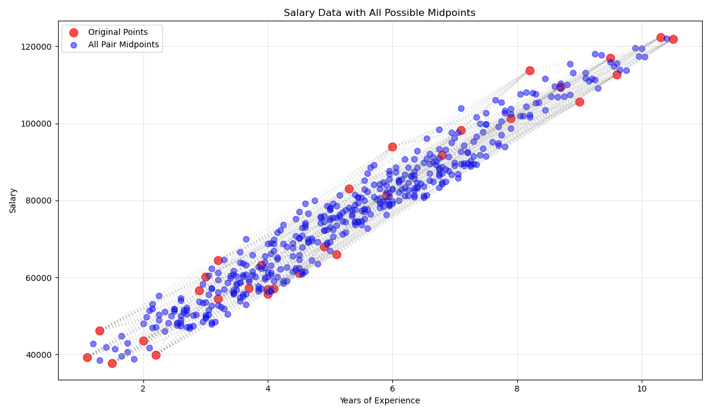
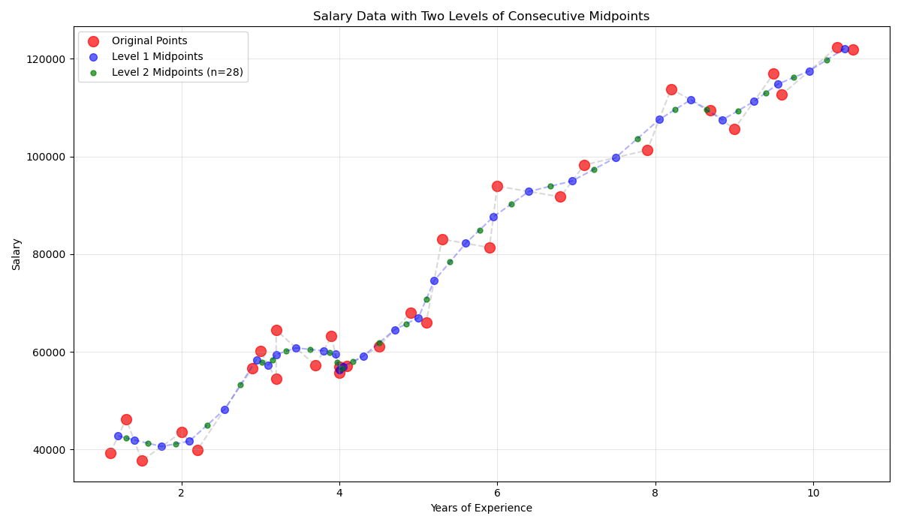
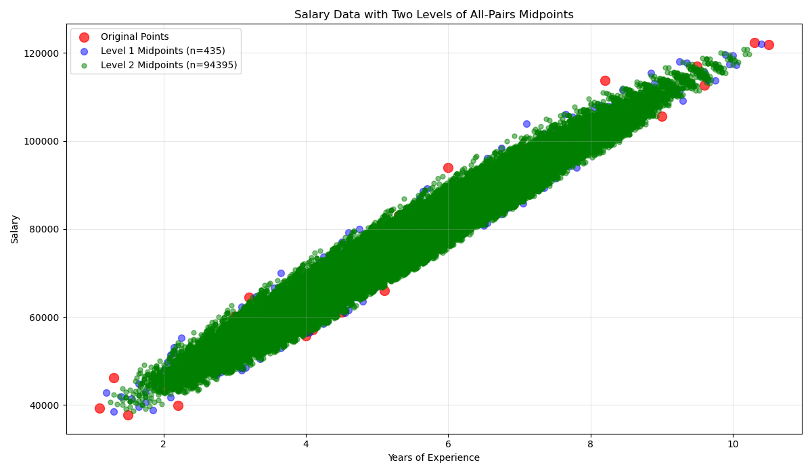
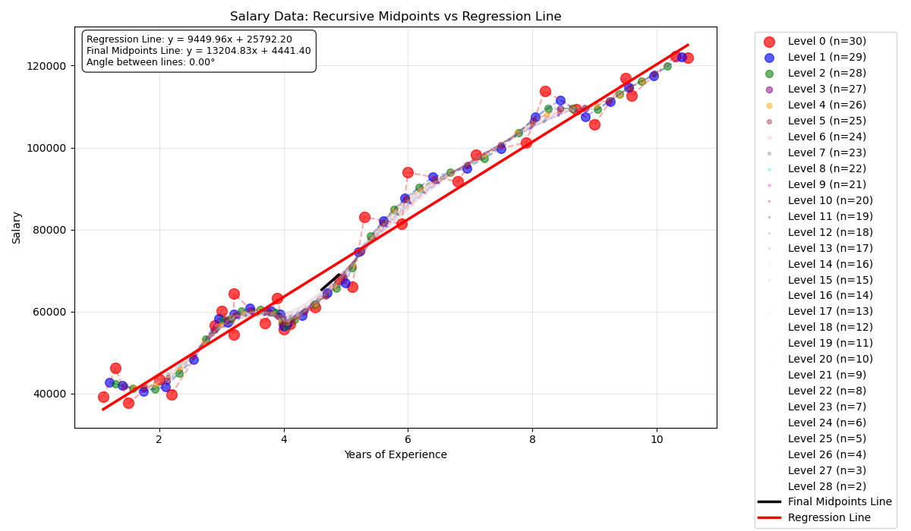

# Regression Analysis Project

This project explores an alternative approach to linear regression using the midpoint method. The main objective is to investigate whether we can derive a regression line using a series of midpoint calculations, potentially offering a different perspective on finding the best-fit line for data points. We compare this midpoint-based approach with the traditional least squares regression method to understand their similarities and differences.

## Project Structure

- `main.py`: Main Python script containing the regression analysis
- `Salary_Data.csv`: Dataset containing salary information
- `plots/`: Directory containing generated visualization plots

## Requirements

- Python 3.x
- Required Python packages (to be listed in requirements.txt)

## Usage

1. Ensure you have the required dependencies installed
2. Run the main script:
   ```
   python main.py
   ```

## Data

The project uses salary data stored in `Salary_Data.csv`. This dataset contains information about salaries and related variables for regression analysis.

## Results and Visualizations

The analysis results and visualizations are stored in the `plots/` directory. The following visualizations demonstrate our step-by-step exploration of the midpoint method:

### 1. Initial Data Visualization

*Initial scatter plot showing the raw data distribution*

### 2. Traditional Linear Regression

*Linear regression line using the conventional least squares method*

### 3. First Level Midpoint Analysis

*First level midpoint calculations showing how we begin constructing our alternative regression line*


*Comprehensive view of first level midpoints demonstrating the pattern formation*

### 4. Second Level Midpoint Analysis

*Second level midpoint calculations showing the refinement of our approach*


*Comprehensive view of second level midpoints revealing the convergence pattern*

### 5. Final Comparison

*Comparison of our midpoint-derived line with the traditional regression line*

Each visualization helps in understanding different aspects of our analysis:
- The scatter plot shows the raw data distribution
- The traditional regression line serves as our baseline for comparison
- The midpoint visualizations demonstrate how we can construct a regression line using a series of midpoint calculations
- The final comparison shows how our midpoint-based approach compares to the traditional method

## License

This project is open source and available under the MIT License. 